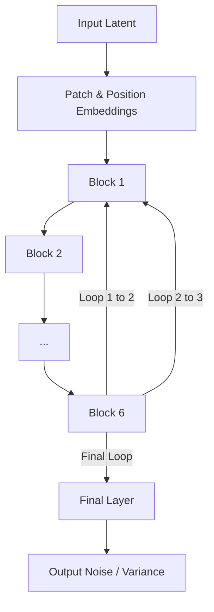

# Elastic Looped Transformers (ELT)

This project contains a faithful, ground-up implementation of the **ELT (Elastic Looped Transformers)** architecture for visual generation, based on the paper *ELT: Elastic Looped Transformers for Visual Generation*.

## Architecture Overview

While traditional visual generation models (like DiT) utilize deep, feed-forward stacks of unique transformer blocks, ELT operates via **recurrent execution**. It defines a compact set of unique transformer blocks and iterates over them multiple times within a single forward pass. 

### Parameter Sharing
ELT physically separates **Model Size** from **Computational Depth**. 
By looping over a core block of $N=6$ unique transformer layers $L=3$ times, the model effectively computes an 18-layer transformation while maintaining the parameter footprint of a 6-layer model. 



## Intra-Loop Self-Distillation (ILSD)

Training a highly recurrent structure can suffer from instability or "black-box" trajectories where early loops yield uninterpretable representations. ELT solves this using **ILSD**:
- **Teacher Path:** The model computes the maximum number of loops ($L_{max}$). The teacher's final prediction is detached from the graph.
- **Student Path:** An intermediate loop count ($L_{int}$) acts as the student. 
- **Loss:** Both the teacher and student receive Ground-Truth (GT) supervision. Additionally, the student receives a distillation loss (MSE) to match the detached teacher's representation.

This joint optimization forces the shared parameters to compress complex transformations into fewer steps, allowing early exits without significant quality degradation.

## Elastic / Any-Time Inference

Because ILSD ensures that intermediate loops produce well-behaved representations, you can run inference elastically. You can trade-off between **computational cost** and **generation quality** purely at test-time by adjusting the `loops` parameter:

```bash
# Low compute, lower quality (1 loop)
python ELT/sample.py --loops 1

# High compute, highest quality (3 loops)
python ELT/sample.py --loops 3
```

## Differences from Baseline DiT

1. **Recurrent Blocks:** DiT uses $N$ sequential blocks. ELT uses $N_{unique}$ blocks wrapped in a recurrent `for` loop executing $L$ times.
2. **Dual-Path Loss:** DiT calculates a single MSE loss per timestep. ELT returns a list of outputs for each loop and computes a composite ILSD + GT loss over these outputs.
3. **Inference Flexibility:** DiT's architecture depth is static. ELT's effective depth can be controlled at runtime.

## Project Structure

- `configs/config.py`: Configuration-driven design exposing loop counts, ILSD weights, etc.
- `models/elt.py`: Core ELT architecture enforcing true parameter sharing.
- `modules/`: Unmodified core DiT sub-components (Embeddings, Transformer blocks).
- `diffusion/`: Borrowed DiT diffusion logic, cleanly modified to handle list predictions for ILSD.
- `train.py`: DDP training loop.
- `sample.py`: Inference script supporting the `--loops` argument.
